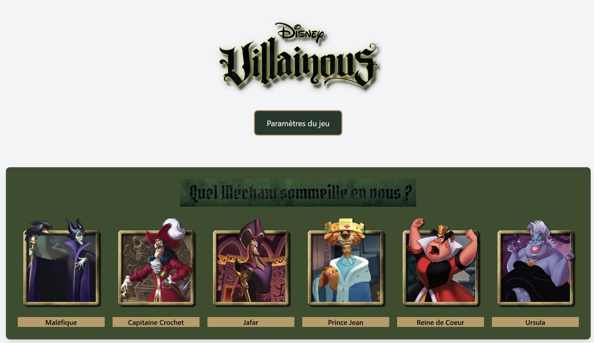
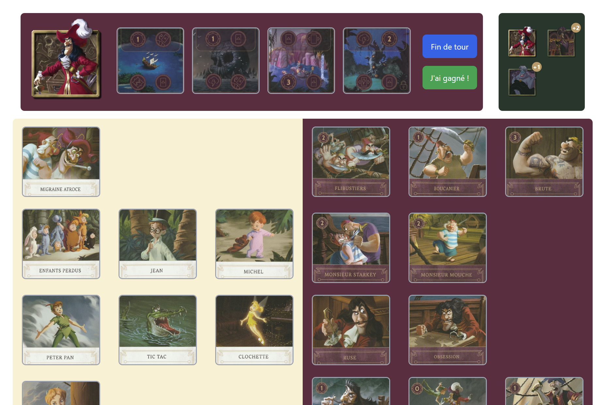

# Disney Villainous - Adaptation Interactive
Ce projet est une adaptation interactive inspirée du jeu de société **Disney Villainous**. Il s'agit d'un jeu de stratégie dans lequel chaque joueur incarne un méchant emblématique de Disney, avec pour objectif de réaliser son objectif diabolique tout en sabotant les plans des autres joueurs.
L'application offre une expérience numérique immersive, combinant des mécaniques de jeu de plateau et des interactions enrichies par des animations, des effets sonores et des vidéos thématiques.

## Fonctionnalités
- **Sélection des méchants** : Les joueurs choisissent parmi une sélection de méchants, organisés par boîtes du jeu.
- **Multijoueurs en local** : Ajoutez plusieurs joueurs et incarnez vos personnages préférés.
- **Gameplay thématique** : Chaque méchant a son propre plateau de jeu (`VillainBoard`), ses cartes (`villainCards` et `fateCards`) et ses lieux à explorer (`places`).
- **Animations & transitions** : Les interactions sont enrichies par des animations fluides (grâce à Framer Motion) et des vidéos captivantes pour les transitions entre les tours.
- **Paramètres adaptables** : Gérez les paramètres du jeu, tels que l'affichage du plateau, des clips audio/vidéo des cartes, ou la langue utilisée.
- **Interface utilisateur réactive** : Profitez d'une UI moderne et intuitive réalisée avec React et TailwindCSS.

## Structure Technique
Le projet est construit avec les technologies suivantes :
- **Framework principal** : React (v18.3.1)
- **Langage** : TypeScript pour une gestion stricte des types
- **Animations** : Framer Motion pour des animations fluides
- **Navigation** : React Router (v7.1.1) pour gérer les différentes pages
- **Gestion de l'état** : Un contexte global (`GameContext`) pour partager l'état entre les composants
- **Styling** : TailwindCSS pour des styles modulaires et réactifs
- **Internationalisation** : react-i18next pour supporter plusieurs langues et traductions
- **Gestion des fichiers** : Chargement dynamique des données des méchants et des boîtes du jeu via des utilitaires
- **Construction** : Vite (v6.0.5) pour démarrer et construire rapidement le projet

## Aperçu du Fonctionnement
### 1. **Sélection des méchants**
- Les joueurs choisissent leurs méchants à l'aide d'une grille interactive affichant les personnages disponibles (gérés par `VillainGrid`).
- Chaque méchant est représenté par un avatar, une couleur thématique, et des cartes associées.


### 2. **Déroulement du jeu**
- Une fois les personnages sélectionnés, chaque joueur accède à son tour à son plateau (`GameBoard`), où il interagit avec ses cartes et lieux.
- Les joueurs peuvent visualiser et jouer leurs cartes (`CardGrid`), activer des lieux (`VillainBoard`), ou recevoir des interférences de la part des autres joueurs.


### 3. **Paramètres personnalisables**
- Une barre de paramètres (`SettingsPanel`) permet de personnaliser les aspects visuels et fonctionnels du jeu, comme l'affichage des détails des cartes et les vidéos des actions.

### 4. **Transitions entre les tours**
- Une transition animée (`PlayerTransition`) annonce le changement de joueur.
- Des vidéos d'introduction et d'outro personnalisées pour chaque méchant renforcent l'immersion du jeu.

## Installation
1. **Cloner le projet** :
``` bash
   git clone https://github.com/shader69/Villainous-Companion
   cd disney-villainous
```
1. **Installer les dépendances** :
``` bash
   npm install
```
1. **Lancer le projet en mode développement** :
``` bash
   npm run dev
```
L'application est accessible à l'adresse : [http://localhost:5173]()
## Exemple d'Organisation des Données
Les villains, boîtes et cartes sont définis par des objets TypeScript dans le fichier `villains.ts`. Voici un aperçu :
- **Boîte (`Box`)** : Représente un ensemble de villains thématiques.
- **Méchant (`Villain`)** : Contient les informations spécifiques du méchant (cartes, lieux, vidéos, etc.).
- **Cartes** : Les cartes sont catégorisées (`villainCards` et `fateCards`) et supportent des clips vidéo interactifs.

## Contribuer
Les contributions sont les bienvenues ! Voici comment participer :
1. Fork ce dépôt.
2. Crée une branche dédiée à ta fonctionnalité ou correction :
``` bash
   git checkout -b feature/nouvelle-fonctionnalite
```
3. Propose une Pull Request avec une description claire des modifications.
